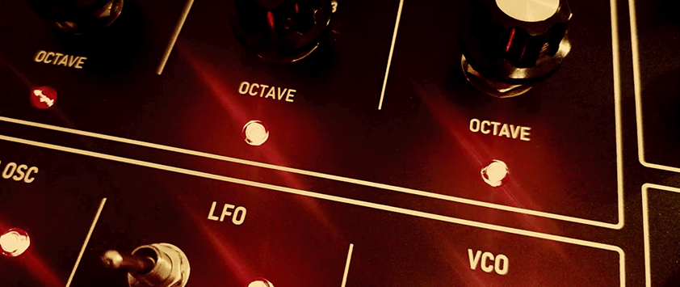
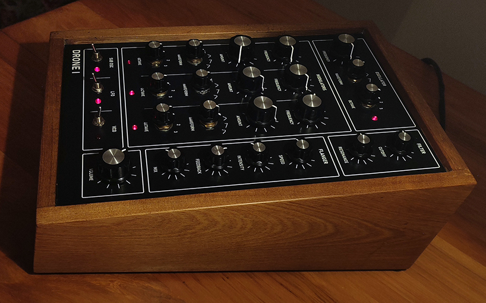
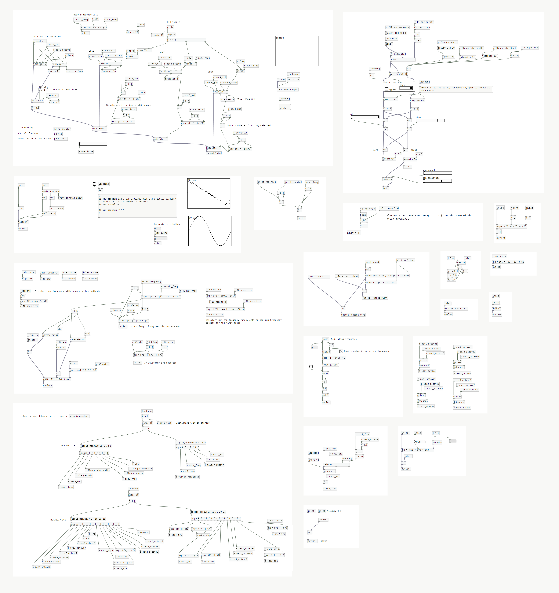

# nullPainter Drone I

The nullPainter Drone I is a four-oscillator drone synthesizer, driven by PureData Vanilla and running on a Raspberry Pi 4 Model B.

</a>

&nbsp;

The Drone I uses wavetable synthesis to generate sine, triangle and sine+triangle waveforms for each oscillator. Oscillators are selectively modulated together and each have a three-octave control. The Drone I features LFO and VCO against the first oscillator, a sub-oscillator, resonance control, a flanger, and blinkenlights for aesthetics. Audio is run through a stereo chorus, panner, compressor, and mid-side mixing. 

To interface the front panel controls, it uses two MCP3008 ICs for analog-to-digital conversion, and two MCP23S17 ICs for GPIO port expansion. These all use SPI bit-banging using the excellent [pigpio](https://abyz.me.uk/rpi/pigpio/) library. The Drone I uses my PureData [pigpio externals](https://github.com/nullpainter/pdpigpio) to read from both ICs and perform regular GPIO writes.

</a>

## Audio samples

Audio samples are available on [Soundcloud](https://soundcloud.com/nullpainter/sets/nullpainter-drone-i-audio-samples).

## Video

A video of the synth in action is on [YouTube](https://www.youtube.com/watch?v=A3pWmTlM0MA).

## MIDI fork

A fork by [farvardin](https://github.com/farvardin) with a PureData GUI and MIDI support is [available here](https://github.com/farvardin/nullpainter_drone).

## Running

1. Clone and build PureData [pdpigpio externals](https://github.com/nullpainter/pdpigpio)
1. Add pdpigpio folders and `externals` folder to pd startup paths
1. Update GPIO pin mappings based on wiring

### GPIO pin mappings

Your pin mappings will most likely be different to mine. The MCP3008 and MCP23S17 pin mappings are defined in the `gpiorouter` subpatch. Additionally, pin mappings for LEDs are specified in the `freqbeat` and `pigpio` externals, used in the main drone patch.

## 

</a>
